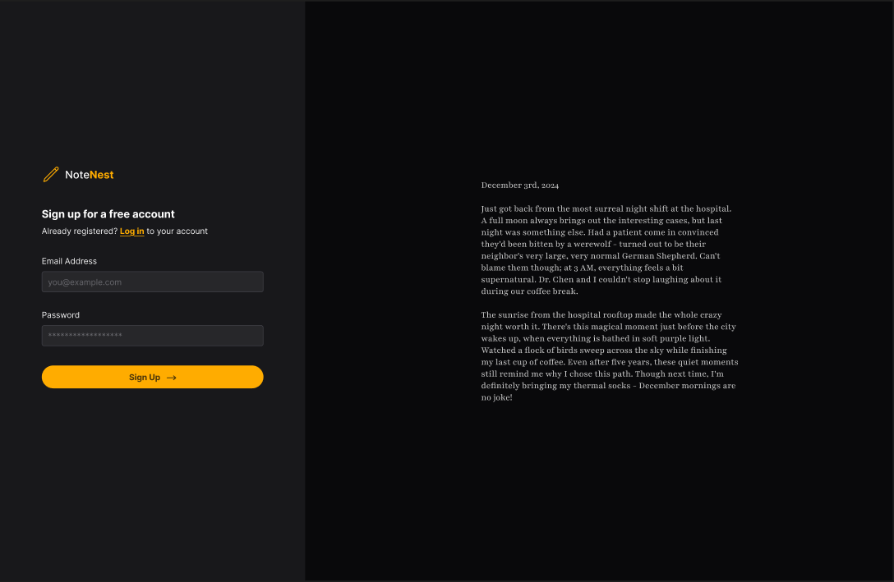
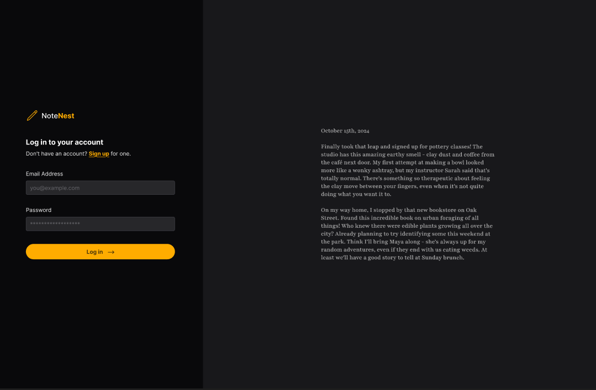
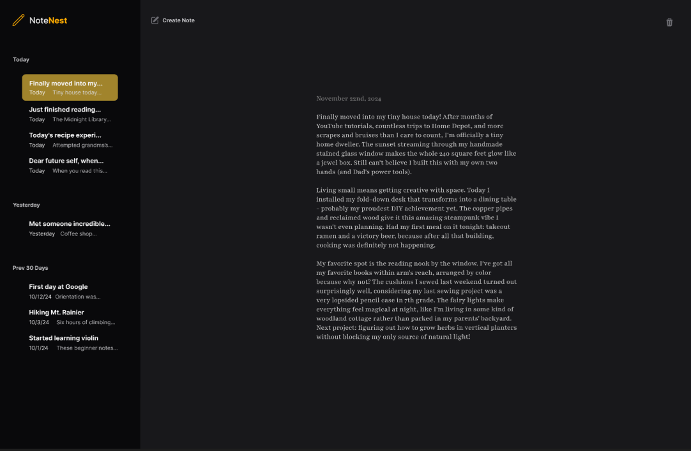

# Apple Notes Clone

A minimal full-stack notes app built with **Nuxt 3**, **Prisma**, and **TypeScript** — inspired by Apple Notes. This app supports user authentication, note creation, editing, deletion, and JWT-based session handling.

## 🚀 Features

- 📝 Create, edit, and delete notes
- 🔐 User authentication (register/login)
- 🧾 JWT-based session management
- 📦 Prisma ORM with MySQL
- ⚡ Minimal UI with Vue 3 components
- 📁 REST API endpoints for interaction

## 🛠 Tech Stack

- [Nuxt 3](https://nuxt.com) + Vue 3 + TypeScript
- [Prisma ORM](https://www.prisma.io/)
- REST API (via Nuxt server routes)
- Tailwind CSS (optional, can be added)
- MySQL (via Prisma)
- JSON Web Tokens (JWT)

## 📁 Project Structure

```
components/       # Vue UI components (NoteCard, Icons)
pages/            # Nuxt pages: index, login, register
middleware/       # Auth middleware
plugins/          # JWT plugin for server-side auth
server/
  api/            # API endpoints: login, notes CRUD, user registration
  utils/          # Prisma client helper
prisma/           # Prisma schema & migrations
public/           # Static assets
```

## 🧪 API Overview

| Endpoint           | Method | Description            |
|--------------------|--------|------------------------|
| `/api/user`        | POST   | Register new user      |
| `/api/login`       | POST   | Login and get token    |
| `/api/notes`       | GET    | Get user notes         |
| `/api/notes`       | POST   | Create new note        |
| `/api/notes/[id]`  | PATCH  | Update a note          |
| `/api/notes/[id]`  | DELETE | Delete a note          |

All secured routes require a valid JWT token.

## 🧬 Prisma Schema

Located in `prisma/schema.prisma`, the schema defines:

- `User`: with `email`, `passwordHash`, `salt`
- `Note`: with `title`, `content`, `userId`

Migrations are located in `prisma/migrations/`.

## ⚙️ Setup Instructions

```bash
# Install dependencies
npm install

# Generate Prisma client
npx prisma generate

# Apply migrations (creates DB)
npx prisma migrate dev

# Start the dev server
npm run dev
```

## 📸 Screenshots

### 📝 Register


### 🔐 Login


### 🏠 Dashboard


## 🪪 License

MIT © [Your Name]
